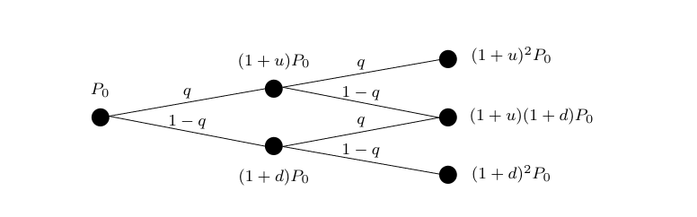

## Definition 1 (CRR Model)

Let \( T \in \mathbb{N} \) be a finite time horizon, \( q \in (0,1) \) and \( u, d > -1 \) with \( d < u \).  
We fix a sequence of independent Bernoulli random variables \( R_1, \ldots, R_T \) taking values in \( \{d, u\} \) such that

\[
\mathbb{P}[R_t = u] = q \quad \text{and} \quad \mathbb{P}[R_t = d] = 1 - q, 
\qquad t = 1, \ldots, T.
\]

The process \( P = \{P_t\}_{t=0, \ldots, T} \) with \( P_0 \in \mathbb{R} \) and

\[
P_t := (1 + R_t) P_{t-1}, 
\qquad t = 1, \ldots, T
\]

models the price of a financial asset in the *Cox–Ross–Rubinstein (CRR)* model.

---

The following figure shows the evolution of the risky asset in the CRR model:

---

### Interpretation

- Each step corresponds to one time increment \( t = 1, \ldots, T \).  
- At each step, the asset price either moves **up** by a factor \( 1 + u \) with probability \( q \),  
  or **down** by a factor \( 1 + d \) with probability \( 1 - q \).  
- The resulting tree describes all possible price paths after \( T \) periods.
